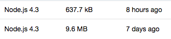

# betty
Simple command line utility for developing and deploying AWS Lambda functions.

Why? Because webpack wasn't cutting it: 



Webpack regularly put out 10MB bundles.  Rollup does magic, and reduces that down to just what's needed.  Like god intended.

## Installing

`yarn add bty --dev`

## Getting started

### Prerequisites

- You must have aws cli named profiles set up so you can use `AWS_PROFILE`.  See https://docs.aws.amazon.com/cli/latest/userguide/cli-multiple-profiles.html
- Create a `resource.json` file in the root of your project directory.  For an example of how to structure a new project, see [this repo](https://github.com/cmawhorter/betty-ddb-crud-microservice).

### Creating a new project
```sh
export AWS_PROFILE=[your profile name]
mkdir my-project && cd my-project
echo '{ "name": "test-betty-function" }' > resource.json
npm install bty --save-dev
mkdir src
echo 'export function handler(event, context, callback) { callback(null, { statusCode: 200, body: JSON.stringify(`hello ${Date.now()}`) }); }' > src/main.js
```

A barebones betty project will now be set up.  You're now ready for development and deployment.

### Developing with betty

All commands should be from project root. 

### Building your function

Under the hood, betty uses rollup to convert your project.  After you make changes to your `src` files, you'll need to do a build.

```sh
bty build --development
```

The result of the build will be placed into `dist/index.js` along with a sourcemap.

#### Serving locally for testing

To invoke your work locally, you can serve your lambda function using a built-in [lambda emulator](https://github.com/cmawhorter/lambda-emulator).

```sh
bty serve --development --type apigateway
```

You should see something like this:

```
Server running at:  http://localhost:3000
```

Open http://localhost:3000 up in a browser if all went well, you'll see something like `hello 1515707821329`.  

If you don't include `--type apigateway`, your lambda emulator will be running in direct invoke mode.  This means that you must use the aws-sdk to invoke your function by doing something like this: 

```sh
# For some reason newer versions of aws-sdk are getting an 
# error and I haven't had a chance to figure out why
# https://github.com/cmawhorter/lambda-emulator/issues/4
npm i aws-sdk@2.7.27
```

And then:

```js
const AWS = require('aws-sdk');
const lambda = new AWS.Lambda({
  endpoint:           'http://localhost:3000', // required
  region:             'local-dev',             // required?
  accessKeyId:        'a',                     // something required
  secretAccessKey:    'b',                     // something required
  maxRetries:         0,                       // optional
});
lambda.invoke({
  // only one handler can be tested per server so this 
  // is largely for logging and making context have something
  // more production-ish
  FunctionName: 'some-function', 
  Payload: JSON.stringify({
    some: 'data',
    goes: true,
    here: {
      now: Date.now(),
    },
  }),
  InvocationType:   'RequestResponse', // ignored by emulator
}, (err, data) => {
  if (err) throw err;
  console.log('Response', data.Payload);
});
```

#### Watching

If you're in the early stages of development, you don't want to have to continuously build/test.  Instead, use watch.

```sh
# You will need to open two tabs.  Don't forget to export AWS_PROFILE=... in 
# your second tab or else you'll get an error
bty build --development --watch
bty serve --development --type apigateway --watch
````

Now, whenever you make changes to `src/main.js` and supporting files, a new build will be created and the lambda emulator will automatically reload it.

### Deploying your function

#### Update AWS

Bundles the contents of `dist/` into a zip file suitable for lambda and creates/updates the remote function.

```sh
AWS_REGION=us-west-2 bty update --development
```

##### Error: Role cannot be assumed by function

This is an aws problem and just means the function (and role) was just created but, the role is not yet available.

Just run the command again and it should complete successfully.  Once a function is created, this error will never happen again.


### Build and updating

Building and deploying can be combined into a single command:

```sh
AWS_REGION=us-west-2 bty deploy --development
```

## resource.json

See the JSON Schema for resource.json for format: https://github.com/cmawhorter/betty/blob/master/schema/resource.json


### Options

It's based on package.json and most of it is self explanatory.

### resource.js

Instead of resource.json, you can use javascript and use `resource.js`.  

This allows you to do powerful things like keep your secrets out of git and staged env vars:

```js
module.exports = {
  "name":               "some-function",
  "configuration": {
    "memory":           256,
    "timeout":          20,
    "source":           "src/main.js",
    "main":             "dist/index.js",
    "entry":            "index.handler",
    // betty sets globals when loading your resource.js file.
    // you can use these for staged deploys.
    // i usually do this and have an empty env.json-template file
    // and other files like env-development.json env-production.json
    "environment":      require(`./env-${global.betty.env}.json`),
  },
  "resources": {
    // if your function depends on another lambda function include it here
    // and it'll automatically get IAM invoke privileges
    "some-other-lambda-function": "*"
  },
  "assets": [
    // if your function owns other aws services, you would place them here.
    // the permissions you specify will be managed by betty.
    // provisioning assets is NOT managed by betty however.  as a matter of
    // convention, i recommend including a ./provision/*.js script that 
    // handles that.  e.g. provision/dynamodb.js would set up these tables
    {
      "service":        "dynamodb",
      "name":           "table/some-table",
      "permissions":    [ "dynamodb:BatchGetItem", "dynamodb:BatchWriteItem", "dynamodb:GetItem", "dynamodb:PutItem", "dynamodb:Query", "dynamodb:UpdateItem" ]
    },
    {
      "service":        "dynamodb",
      "name":           "table/some-table/*",
      "permissions":    [ "dynamodb:BatchGetItem", "dynamodb:BatchWriteItem", "dynamodb:GetItem", "dynamodb:PutItem", "dynamodb:Query", "dynamodb:UpdateItem" ]
    }
  ],
  // if this function will be consumed by other functions downstream, create a policy.
  // these permissions will automatically be granted to those functions. 
  // this is the policy that gets granted via resources above.
  // most of the time this will look identical to what's here.  
  "policy": [
    {
      "service":        "lambda",
      "region":         "*",
      "name":           "function:marketplace-checkout",
      "permissions":    [ "lambda:InvokeFunction" ]
    }
  ]
};```

